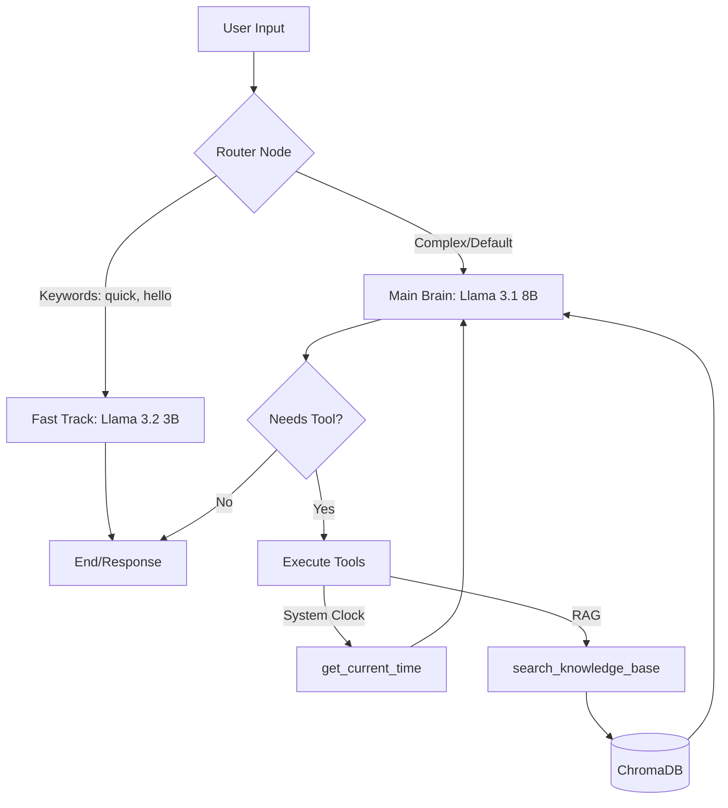

# Ahmad-AI Architecture & Playbook

## 1. Overview
Ahmad-AI is a local, offline-first Artificial Intelligence agent built using Python, LangGraph, and Ollama. It utilizes a multi-model routing architecture to optimize for both speed and complex reasoning, integrated with a local vector database (ChromaDB) for Retrieval-Augmented Generation (RAG).

---

## 2. System Architecture

The agent operates on a state machine built with LangGraph. When a user submits a query, it follows a specific execution path based on intent.



### Component Breakdown

* **Router Node:** A lightweight Python function that checks the user's prompt for specific keywords to determine if the query requires deep thinking or just a fast response.
* **Fast Track (Llama 3.2 3B):** Handles basic greetings and simple queries instantly. *Note: Does not have access to tools.*
* **Main Brain (Llama 3.1 8B):** The primary reasoning engine. It has access to bound tools and decides when to search the knowledge base or check system utilities.

---

## 3. Environment Setup & Installation

To recreate this environment from scratch, execute the following commands:

### Step 3.1: Download Local Models

```bash
ollama pull llama3.1:latest
ollama pull llama3.2:3b
ollama pull nomic-embed-text

```

### Step 3.2: Python Virtual Environment

```bash
python -m venv venv
venv\Scripts\activate
python -m pip install --upgrade pip

```

### Step 3.3: Install Dependencies

```bash
pip install langgraph langchain langchain-ollama langchain-community langchain-chroma chromadb fastapi uvicorn python-dotenv

```

---

## 4. Core Concepts

### LangGraph (State Machine)

Instead of a simple linear script, Ahmad-AI is built as a **Graph**.

* **State:** A shared dictionary (memory) passed between functions.
* **Nodes:** Python functions that do the actual work (e.g., `call_main_model`).
* **Edges:** The pathways connecting the nodes.
* **Conditional Edges:** Logic that decides which path to take next (e.g., looping back to the LLM after a tool is used).

### RAG (Retrieval-Augmented Generation)

Large Language Models hallucinate when they lack specific facts. RAG solves this by providing the LLM with an open book.

1. **Retrieve:** Search the local database for relevant text.
2. **Augment:** Inject that text into the LLM's prompt invisibly.
3. **Generate:** The LLM reads the injected text and formats an accurate answer.

### Embeddings (`nomic-embed-text`)

Text cannot be searched purely by keywords if the vocabulary doesn't match exactly. An embedding model converts sentences into arrays of numbers (vectors) based on their *meaning*. ChromaDB calculates the mathematical distance between the user's question and your documents to find the closest conceptual match.

---

## 5. Known Quirks & Troubleshooting

During development, we identified two critical behaviors that require specific engineering solutions:

### Quirk 1: The Routing Flaw (Tool Starvation)

* **Symptom:** When asked "What is the exact time?", the AI replied that it didn't know and couldn't access the internet.
* **Root Cause:** The `route_question` node saw the word "time" and sent the request to the `fast_track` node (Llama 3.2 3B). However, only the `main_brain` was granted access to the `get_current_time` tool. The fast model was starved of the tool it needed to fulfill its routed task.
* **Fix Strategy:** Either remove tool-dependent keywords (like "time") from the router, or bind basic tools to the fast model as well.

### Quirk 2: Tool-Call Leakage (Raw JSON Output)

* **Symptom:** When asked "Are you connected to the internet?", the AI output raw JSON (`{"name": "search_knowledge_base"...}`) instead of executing the search.
* **Root Cause:** Open-source models occasionally fail to trigger the internal function-calling API flag, instead outputting their internal thought process (the tool request) as standard text.
* **Fix Strategy:** Implement a strict system prompt enforcing tool-calling formatting, or add a LangChain fallback parser that catches raw JSON in the text output and forces the tool execution manually.

```

```